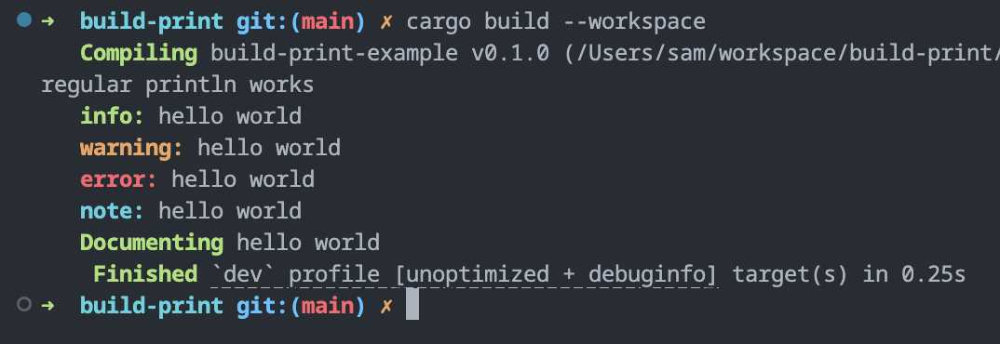

# build-print

A simple set of macros that allow regular printing as well as properly formatted info,
warnings, errors, and notes during build scripts.

Traditionally, there are only two ways to print to the console during a build script:
* `println!("cargo:warning=...")` to print a somewhat annoyingly formatted warning message
* `panic!(..)` to halt the build process and print an error message

Regular `println!` statements are not shown during the build process, so this crate hijacks
the `cargo:warning=...` variant using ANSI escape sequences to produce a working `println!`
macro as well as `info!`, `warn!`, `error!`, and `note!` macros that following the
indentation and coloring of standard cargo diagnostic messages.

You can also define your own custom print messages using the `custom_println!` macro, which
is also the basis for the other macros.

# Example
```rust
// build.rs
use build_print::{println, *};

fn main() {
    println!("regular println works");
    info!("hello world");
    warn!("hello world");
    error!("hello world");
    note!("hello world");
    custom_println!("Documenting", green, "hello world");
}
```


